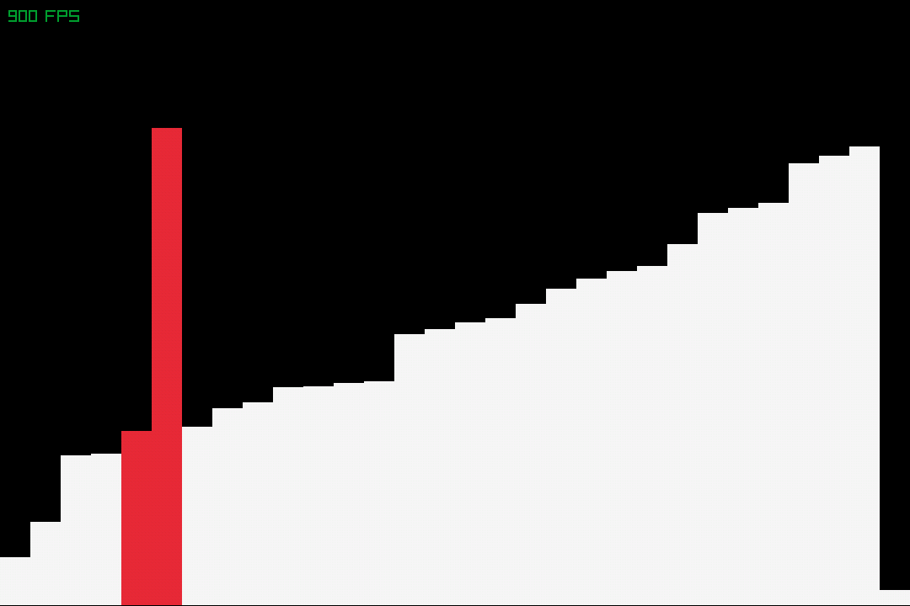
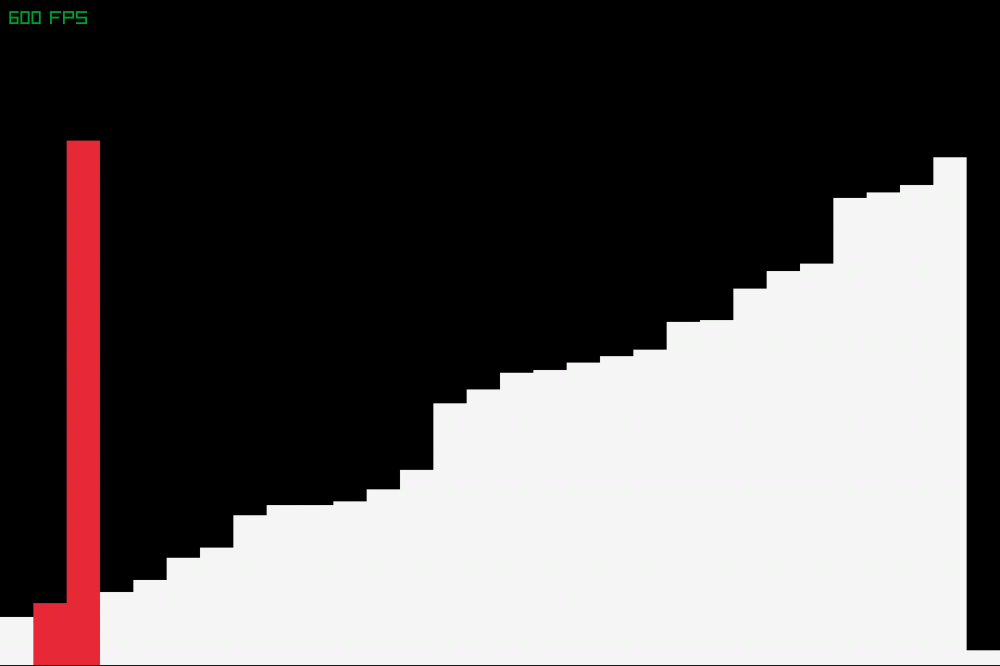

# Sort Visualizer
A simple sorting visualizer built with raylib. It supports multiple sorting algorithms, and can record the sorting process as a gif.

* ### Bubble Sort Visualization


* ### Insertion Sort Visualization



## Installation

1. Clone the repository:

```bash
git clone https://github.com/bajfi/SortVisualizer.git
```

2. Build the project using CMake:

```bash
cd SortVisualizer
mkdir build
cd build
cmake .. -DCMAKE_BUILD_TYPE=Release
cmake --build .
```

## Usage
```bash
./bin/sortVisualizer
```

## 📄 License
This project is licensed under the MIT License - see the [LICENSE](LICENSE) file for details
